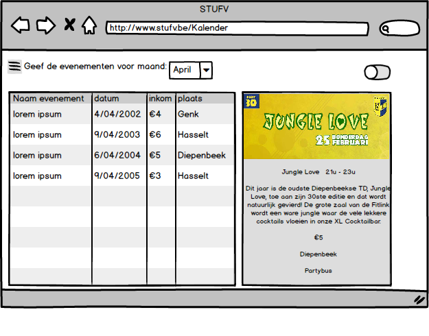

#Mockups STUFV

##Desktop versie site

 De kleuren worden tijdens het programmeren vervangen door foto's. De kleuren dienen om een idee te krijgen.
In de tegels komt inhoud over de verschillende onderdelen (ehbo, evenementen, pushberichten,...)
 

 Dit is de side menu, hierin staan er links naar allerlei social media. Het logo van CAD wordt later aangepast naar 
een logo van STUFV. Het slide menu zal op iedere pagina van de website beschikbaar zijn, om zo vlot te navigeren.
 

 Wanneer de bezoeker op "Gebruiker login" klikt, zal hij op deze pagina uitkomen.
Hier kan hij zich aanmelden/registreren/verloren wachtwoord terug vragen.
 

 Deze pagina wordt geladen wanneer de bezoeker op "Mijn organisatie" klikt.
Hier kan hij zich zich aanmelden/registreren/verloren wachtwoord terug vragen.
 

 Wanneer een bezoeker op "Wachtwoord vergeten" heeft geklikt zal hij op deze pagina uitkomen.
Hier moet hij zijn e-mailadres ingeven, vervolgens krijgt hij een mail om zijn wachtwoord te herstellen.
 

 Als er op de knop "registreren" wordt geklikt vanuit het aanmeldvenster voor gebruikers, zal de bezoeker hierop uitkomen.
Hier kan hij zich registreren als gebruiker.
 

 Als er op de knop "registreren" wordt geklikt vanuit het aanmeldvenster voor organisatoren, zal de bezoeker hierop uitkomen.
Hier kan hij zich registreren als organisator.Onderaan komt een overzicht van andere organisatoren die al lid zijn van de site.
 

 Dit is het venster waarop de organisator uitkomt indien hij zich heeft aangemeld.
Hier krijgt hij een overzicht van de recentste evenementen.Wanneer hij op een evenement klikt zal het grijze gedeelte veranderen.
Hierin komt meer info over het geselecteerde evenement. Hij vindt hier oa zijn feestwijzer sterren, het aantal (dis)likes, aantal bezoekers,...
Vanuit het blauwe gedeelte kan hij ook een nieuw evenement aanmaken of een 
overzichtvragen van al zijn evenementen tonen.
 

 Wanneer de organisator op "overzicht evenementen" klikt, veranderd het onderste gedeelte van het scherm.
Hier komt een list van gepasseerde events/opkomende events afhankelijk van zijn keuze uit het dropdown menu.
Het pauze-teken betekend dat zijn evenement nog niet bekeken is door de admin. Een groen vinkje wilt zeggen dat zijn evenement is goedgekeurd en op de site komt.
Een rood kruis wilt zeggen dat het evenement is afgekeurd.
 

 De organisator kan op deze pagina een evenement toevoegen. Hij dient alle velden in te vullen.
Nadat hij dit heeft gedaan krijgt hij een melding dat het evenement toegevoegd/opgestuurd voor beoordeling is.

 Als de organisator een evenement wilt wijzigen/verwijderen kan hij dit op deze pagina.Hier komt hij als hij op het 
instelling icoontje van het evenement klikt.

 Wanneer de gegevens van de organisatie niet meer correct zijn, kan de organisator dit aanpassen op deze pagina.
In de textboxes staan de waardes hoe ze in de database staan.Nadat de organisator op "pas aan" heeft geklikt, worden
eventuele veranderingen opgeslaan in de database.

 Hier worden evenementen getoond a.d.h.v. de voorkeuren van de gebruiker. Wanneer een gebruiker geintresseerd is
om naar het getoonde evenementen te gaan, kan hij op de groene knop klikken. Hiermee zet hij zich op aanwezig. 

 Wanneer de gebruiker de pijltjes rechts onderaan omhoog sleept/klikt, verschijnt er een balk waar hij kan instellen welke
evenementen hij wil zien in de slider.

 De gebruiker kan de slider ook uit zetten door de switch rechts boven uit te klikken. Dan krijgt hij een
overzicht van alle evenementen met meer info erover.

 Hier vindt de gebruiker een overzicht van evenementen waar hij op aanwezig staat en ook de
evenementen die hij recent bezocht heeft. Wanneer hij op een evenement klikt waar hij onlangs naartoe is geweest, komt hij
op een pagina uit waar hij de feestwijzer vragen kan beantwoorden.

 Dit is de pagina waarop de gebruiker de vragen over feestwijzer kan beantwoorden.

 De vervoer pagina wordt geladen wanneer de gebruiker op "vervoer" klikt. Hier kan hij opgeven of hij bob is of als hij nog vervoer zoekt.
Afhankelijk van zijn antwoord komen er onderaan personen te staan die bob zijn / vervoer zoeken. In dit geval is de persoon bob.

 Dit is de slider die de gebruiker krijgt als hij vervoer zoekt.

 Op deze pagina vindt de bezoeker meer info over ehbo. Zo zijn er verschillende noodnummers, filmpjes,... ter beschikking.

 Op de contact pagina vindt de bezoeker de contactgegevens van de verantwoordelijke van STUFV.

##Mobile versie site

